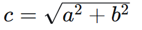
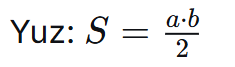
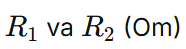
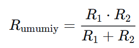
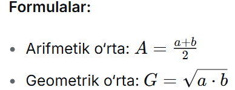
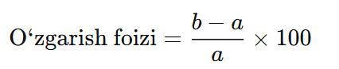

# 3- va 4-darsdan Berilgan vazifalar:
## SHART - FOYDALANUVCHIDAN 2 TA SON SO'RASH VA ULAR ASOSIDA 4 TA ASIFMETIK AMALLAR BAJARISH !
Solving Math issues

## Yechilishi !
## 4 ta Arifmetik amllalar olamiz !
# 1. 📐 To‘g‘ri burchakli uchburchak gipotenuzasi va yuzi
# Gipotenuza:  
# 
## Qayerda ishlatiladi: Geometrik masalalarda, masofa hisoblashda, qurilishda.
# 2. 🔌 Parallel ulangan ikki qarshilikning umumiy qarshiligi
## Berilgan: 
## Formula: 
## 3. 📊 Geometrik va arifmetik o‘rta (o‘rtacha qiymatlar)
## Berilgan: ikkita musbat son a va b
## 
## Qayerda ishlatiladi: Statistikada, investitsiyalarning o‘rtacha daromadini hisoblashda (geometrik o‘rta), oddiy o‘rtachani topishda. 
# 4. 💰 Protsent farqi (o‘zgarish foizi)
## Berilgan: boshlang‘ich qiymat a va yakuniy qiymat b
## 
# Qayerda ishlatiladi: Narx o‘zgarishi, foizli hisob-kitoblar, savdo tahlilida.
